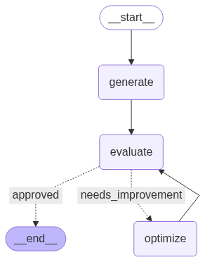

# TweetCraft 🧠✨

**TweetCraft** is an AI-powered tweet and post generator designed to create engaging, optimized social media content using Large Language Models (LLMs).  
It follows a structured **generate → evaluate → optimize** workflow to ensure each output is polished, creative, and ready to post.

---

## 🧩 Project Overview

This project automates the content creation cycle for tweets or short-form posts.  
It uses an iterative feedback process where generated content is evaluated and refined until it meets the desired quality.

The workflow stages:
1. **Generate:** Produce initial content using an LLM.
2. **Evaluate:** Assess the generated text based on criteria like tone, clarity, and engagement.
3. **Optimize:** If needed, refine and improve the output for better results.

---

## 🧠 Tech Stack

- **Python 3.10+**
- **LangChain** – for chaining prompts and LLM logic  
- **OpenAI API** – for text generation  
- **Jupyter Notebook** – for experimentation and fine-tuning  
- **Standard Libraries:** `os`, `json`, `dotenv`, etc.

---

## ⚙️ Setup Instructions

1. **Clone the Repository**
   ```bash
   git clone https://github.com/hendrix0731/TweetCraft.git
   cd TweetCraft
   ```

2. **Create a Virtual Environment (optional but recommended)**
   ```bash
   python -m venv venv
   source venv/bin/activate  # for Linux/Mac
   venv\Scripts\activate     # for Windows
   ```

3. **Install Dependencies**
   ```bash
   # Install required libraries directly
   pip install openai langchain python-dotenv
   pip install jupyter
   ```

4. **Add Your OpenAI API Key**
   Create a `.env` file in the root directory and include:
   ```
   OPENAI_API_KEY=your_api_key_here
   ```

---

## 🚀 Usage

Run the notebook in Jupyter or VS Code:

```bash
jupyter notebook X_post_generator.ipynb
```

Follow the notebook cells step by step to:
- Generate AI-powered tweets/posts
- Evaluate their quality
- Automatically optimize them if needed

---

## 🔁 Workflow Diagram

Below is the Sample visual representation of the project flow:



---

## 👨‍💻 Author

**Developed by Harsh Joshi**  


---

## 🌟 Key Features

- Automatic tweet/post generation using AI  
- Evaluation loop for content quality improvement  
- Modular, reusable notebook structure  
- Easy integration with social media APIs  

---

> *“Generate. Evaluate. Optimize. Tweet Smarter with AI.”*
